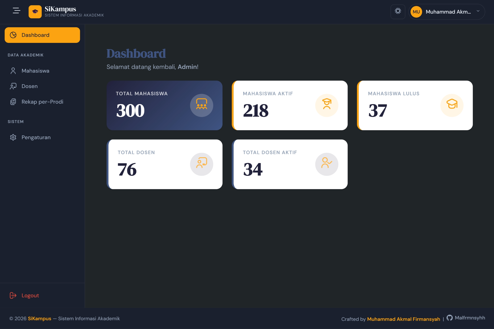
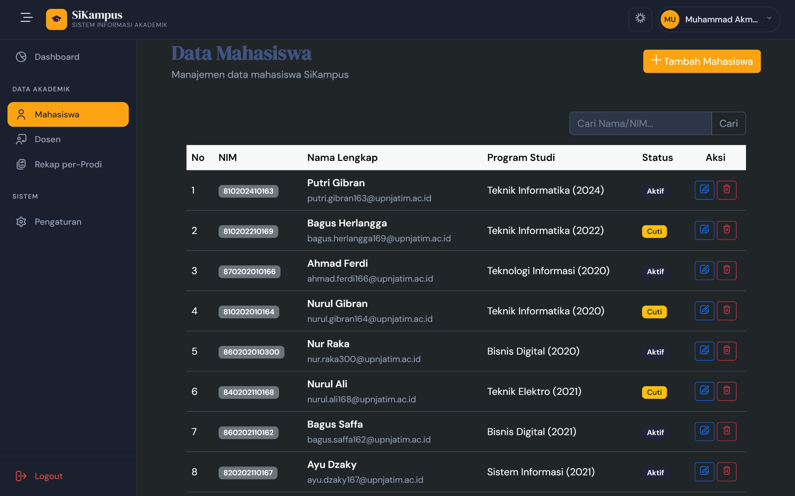
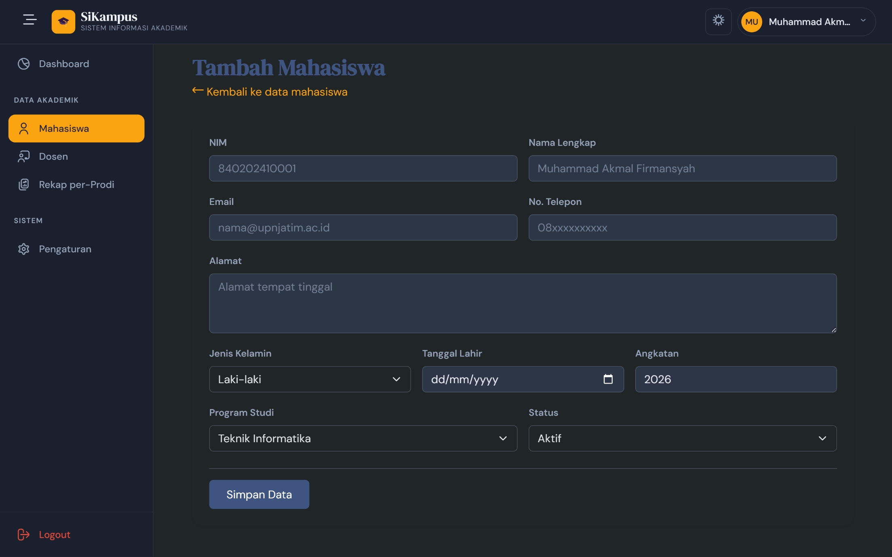
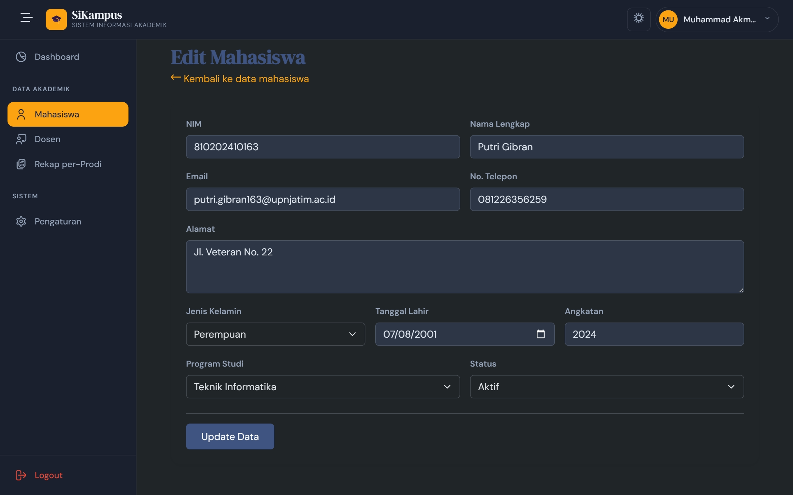
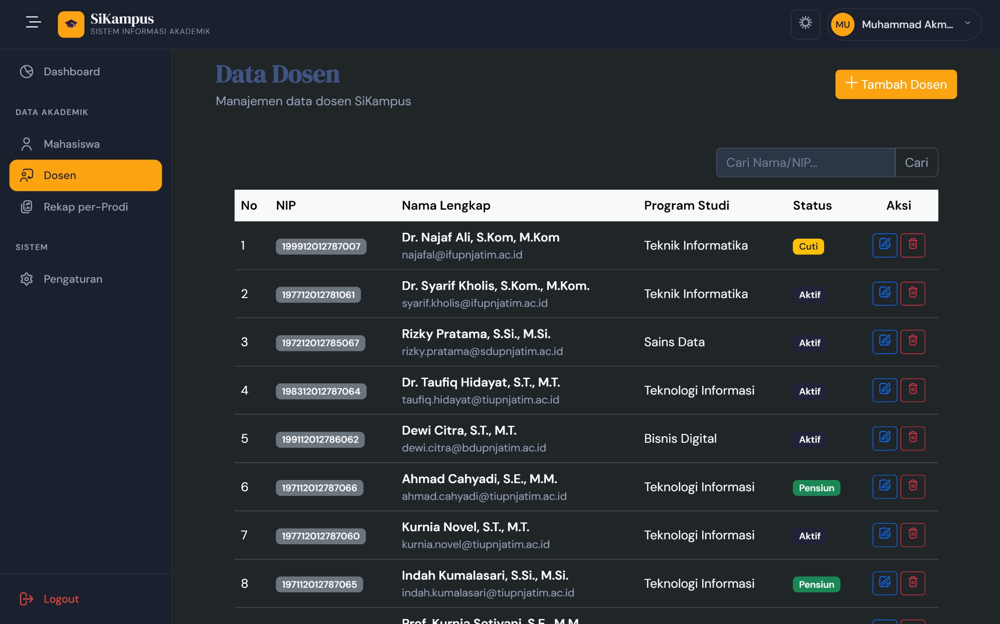
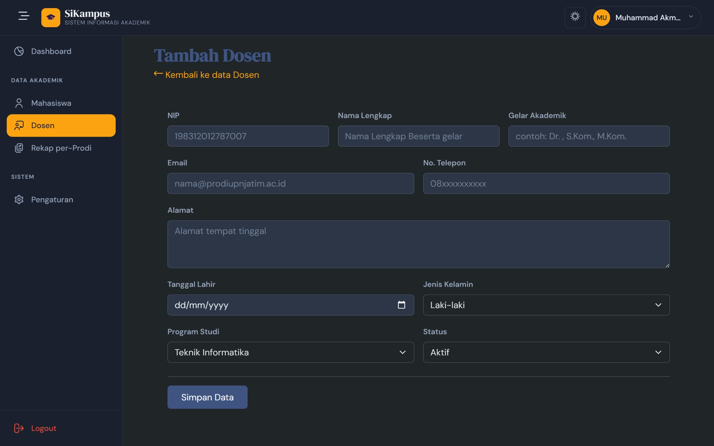
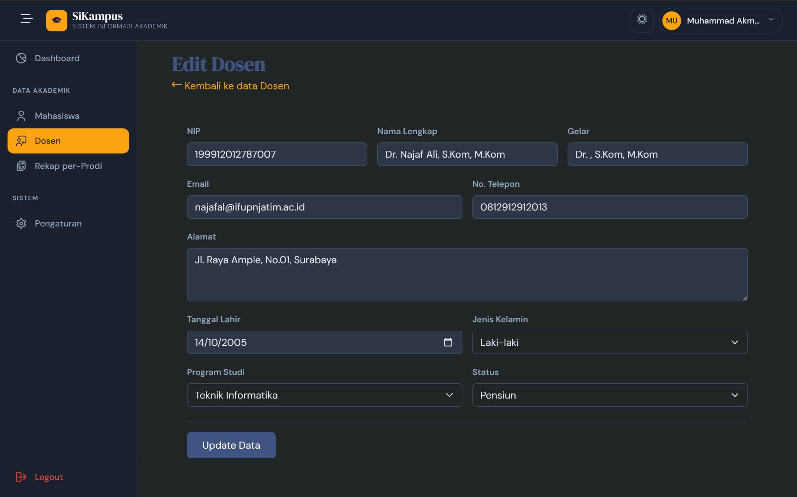
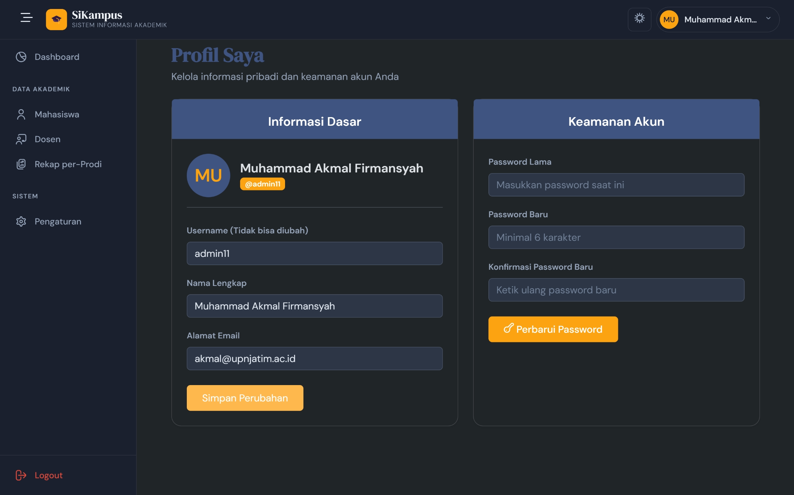

<div align="center">

# 🎓 SiKampus — Sistem Informasi Akademik

**Admin Dashboard** untuk manajemen data Mahasiswa dan Dosen berbasis **PHP Native & MySQL**


</div>

---

## 📌 Tentang Proyek

**SiKampus** adalah sebuah sistem informasi akademik berbasis web yang dibangun menggunakan **PHP Native** (tanpa framework), dirancang khusus untuk memudahkan administrator kampus dalam mengelola data civitas akademika secara terpusat.

Proyek ini dikembangkan sebagai tugas akademik sekaligus portofolio, dengan fokus pada penerapan konsep **MVC sederhana**, **keamanan autentikasi (Session + Bcrypt)**, dan **desain UI/UX modern** menggunakan Bootstrap 5.

---

## ✨ Fitur Utama

| Fitur | Deskripsi |
|---|---|
| 🔐 **Autentikasi Aman** | Login Admin dengan session PHP & enkripsi password Bcrypt (`password_hash`) |
| 📊 **Dashboard Statistik** | Ringkasan data real-time: total mahasiswa, dosen, dan status aktif |
| 🎓 **Manajemen Mahasiswa** | CRUD lengkap — Tambah, Lihat, Edit, Hapus data mahasiswa |
| 👨‍🏫 **Manajemen Dosen** | CRUD lengkap — Tambah, Lihat, Edit, Hapus data dosen beserta gelar akademik |
| 🔍 **Pencarian & Pagination** | Filter data mahasiswa/dosen dengan query search + pembatasan 10 baris per halaman |
| 👤 **Manajemen Profil Admin** | Ubah nama, email, dan password dengan validasi keamanan berlapis |
| 🌙 **Dark Mode** | Toggle tampilan terang/gelap yang tersimpan di `localStorage` browser |
| 📱 **Sidebar Collapsible** | Panel navigasi yang bisa dilipat untuk tampilan yang lebih luas |

---

## 🛠️ Tech Stack

- **Backend:** PHP 8.x (Native, tanpa framework)
- **Database:** MySQL (via MySQLi)
- **Frontend:** HTML5, Bootstrap 5.3, Vanilla CSS (Custom Design System)
- **Ikon:** Flaticon UIcons Regular Rounded
- **Font:** Google Fonts — DM Sans & DM Serif Display
- **Tools:** Laragon (Local Server), phpMyAdmin

---

## 🎨 Palet Warna Custom

Sistem dibangun di atas palet warna yang dirancang khusus melalui CSS Custom Properties:

| Variabel | Hex | Kegunaan |
|---|---|---|
| `--space-indigo` | `#22223B` | Warna primer sidebar & teks utama |
| `--prussian-blue` | `#3F5482` | Aksen tombol & judul halaman |
| `--orange` (Gold) | `#FCA311` | Tombol aksi utama & badge |
| `--alabaster-grey` | `#E5E5E5` | Latar belakang konten |

---

## 📁 Struktur Proyek

```
Project/
├── 📂 assets/
│   ├── css/
│   │   ├── variables.css   # Custom Properties (Palet Warna)
│   │   ├── global.css      # Style global & Dark Mode overrides
│   │   └── sidebar.css     # Styling komponen sidebar
│   └── js/
│       └── app.js          # Logika Dark Mode & Sidebar Toggle
│
├── 📂 auth/
│   ├── login.php           # Halaman login
│   ├── auth-check.php      # Proses validasi kredensial
│   └── logout.php          # Destroy session & redirect
│
├── 📂 config/
│   ├── conn.php            # Koneksi database (MySQLi)
│   └── middleware.php      # Proteksi halaman (Session Guard)
│
├── 📂 modules/
│   ├── mahasiswa/          # CRUD Mahasiswa (index, create, edit, delete)
│   ├── dosen/              # CRUD Dosen (index, create, edit, delete)
│   └── profil/             # Manajemen profil Admin
│
├── 📂 templates/
│   ├── header.php          # Navbar, aset CSS/JS, session init
│   ├── sidebar.php         # Navigasi sidebar
│   └── footer.php          # Script JS & penutup tag
│
├── dashboard.php           # Halaman utama dashboard
├── schema.sql              # Struktur & data awal database
├── seedermhs.php           # Seeder data dummy Mahasiswa
└── seederdosen.php         # Seeder data dummy Dosen
```

---

## 🚀 Cara Menjalankan Proyek

### Prasyarat
- [Laragon](https://laragon.org/) / XAMPP / WAMP terinstal
- PHP >= 8.0
- MySQL >= 5.7

### Langkah Instalasi

**1. Clone repositori ini**
```bash
git clone https://github.com/Malfrmnsyhh/dahsboard_admin.git
```
> Letakkan folder di dalam direktori `www` Laragon atau `htdocs` XAMPP.

**2. Buat database baru**

Buka **phpMyAdmin** dan buat database baru (contoh: `db_sikampus`).

**3. Import skema database**

Import file `schema.sql` yang ada di root proyek ke database yang baru dibuat.

**4. Sesuaikan konfigurasi koneksi**

Buka file `config/conn.php` dan sesuaikan kredensial database Anda:
```php
$conn = new mysqli('127.0.0.1', 'root', '', 'db_sikampus', 3306);
```

**5. Isi data dummy (Opsional)**

Akses URL berikut di browser Anda untuk mengisi data contoh:
```
http://localhost/Project/seedermhs.php
http://localhost/Project/seederdosen.php
```

**6. Akses Aplikasi**

Buka browser dan navigasikan ke:
```
http://localhost/Project/auth/login.php
```

**Kredensial Default Admin:**
| Field | Value |
|---|---|
| Username | `admin` |
| Password | `admin123` |

---

## 📸 Tampilan web
- **Auth page**

- **Dashboard**

- **Form Mahasiswa**

- **Tambah Mahasiswa**

- **Edit Mahasiswa**

- **Form Dosen**

- **Tambah Dosen**

- **Edit Dosen**

- **Profil**


---

## 🔒 Fitur Keamanan

- **Password Hashing:** Semua password di-hash menggunakan `password_hash()` dengan algoritma **Bcrypt** (PASSWORD_DEFAULT).
- **Session Guard (Middleware):** Setiap halaman modul dilindungi oleh fungsi `check_auth()` yang memverifikasi sesi sebelum memberikan akses.
- **SQL Injection Prevention:** Semua input dari pengguna diproses melalui `$conn->real_escape_string()` sebelum dimasukkan ke dalam query.
- **Password Verification:** Ganti password menggunakan `password_verify()` untuk memastikan kecocokan dengan hash yang tersimpan.

---

## 🗺️ Rencana Pengembangan (Roadmap)

- [ ] Modul **Pengaturan Sistem** (Tahun Akademik, Semester Aktif)
- [ ] Fitur **Ekspor Data** ke Excel/PDF
- [ ] Portal mandiri untuk Mahasiswa & Dosen (*Self-Service*)
- [ ] Implementasi **CSRF Token** untuk keamanan form
- [ ] Perbaikan **Responsivitas Mobile** pada sidebar

---

## 👨‍💻 Pengembang

**Muhammad Akmal Firmansyah**

> Proyek ini dikembangkan sebagai bagian dari tugas akademik dan portofolio pengembangan web.

---

